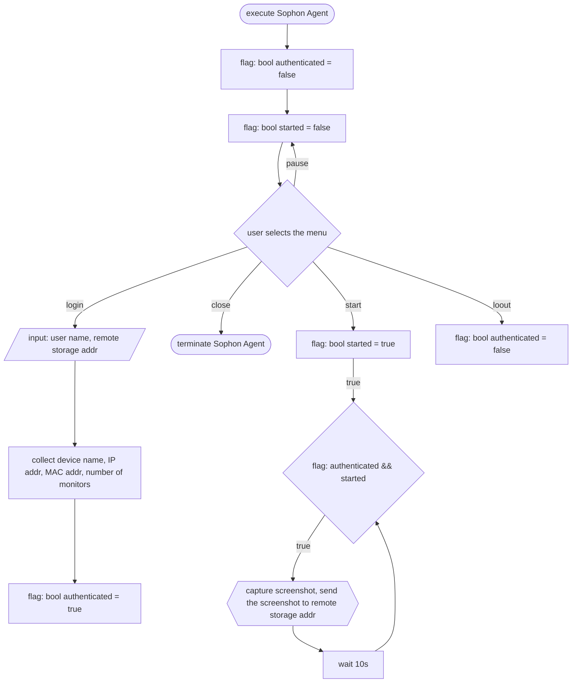

## Design

## TODO
- Sending the screenshot to remote storages (GCP Storage, AWS S3, Google Drive, NFS, on-premise repo)
- Remote storage authentication
- Shoot screenshot to png instead of bmp
- Screenshot encryption
- Screenshot compression
- Screenshot per monitor
- Low level screenshot instead of GDI, in order to shoot DRM/secure programs
## Changelog
#### v0.1.0
###### Framework
- Win32API: For precise system control, Faster & Simpler code than MFC (MFC is not pretty & difficult for Bin)
- Visual Studio 2022
###### Features
- Window minimization as a system tray icon
- 4 buttons: Login, Logout, Start, Pause
- 2 indicators: Auth status (login/logout), Run status (start/pause)
- Capturing bmp screenshot per 10s with Windows GDI functions
- Save the screenshots in the same path where the sophon-agent.exe locates
- Added curl libraries
